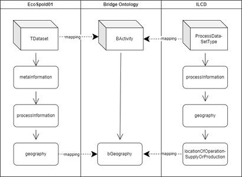

# Bridge

Creating RDF versions of existing environmental databases is not sufficient to offer a homogenous inter-face that enables querying for data described in different data formats. Since, (even in RDF) those databases remain described in different ways; which is desirable, as our objective is not to create yet another standard; we want to provide practical tools that can offer a way to seamlessly query data expressed in al-ready established standards. To this end, we created the WISER [bridge ontology](https://ieeexplore.ieee.org/document/8102271); with the following requirements in mind: 

1)	Provide a query interface for SP3 (the WISER API) that enables the querying of all the data required for the demonstrator dashboards.
2)	Provide a common data structure that bridges the different data formats that have been converted to RDF and thus enable requirement 1.

 
Figure 5. Creating a bridge property between EcoSpold01 and ILCD geographies definitions

To illustrate the WISER bridge ontology, let us consider the geography of a Dataset (EcoSpold01) or a Process (ILCD). On the left of Figure 5, the concept TDataset (i.e., an activity) for EcoSpold01 is shown, which is related to its meta information, its process data, and its geography. On the right side of Figure 5, the ILCD equivalences are shown. However, different names are used e.g., a dataset is called ProcesDa-taSetType, and the corresponding geography field is called locationOfOperation-SuppyOrProduction. To provide the homogenous interface, we created a concept called BActivity, which acts as a parent class of TDataset and ProcesDataSetType, and is related to the property bGeography, which is a parent property of geography and locationOfOperationSuppyOrProduction. In this way, instead of querying the corresponding fields of EcoSpold01 or ILCD, we query for the bridge property bGeography, and can retrieve datasets ex-pressed in EcoSpold01 or ILCD. In other words, we can query both databases by making a request for information through the WISER bridge ontology instead of making two different queries for the two different databases. 

