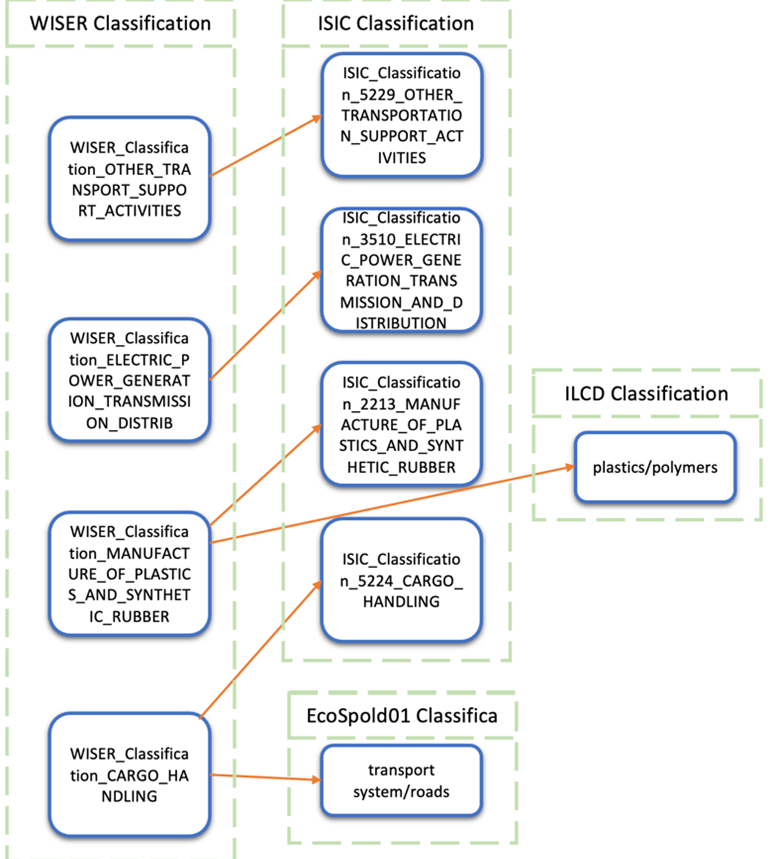
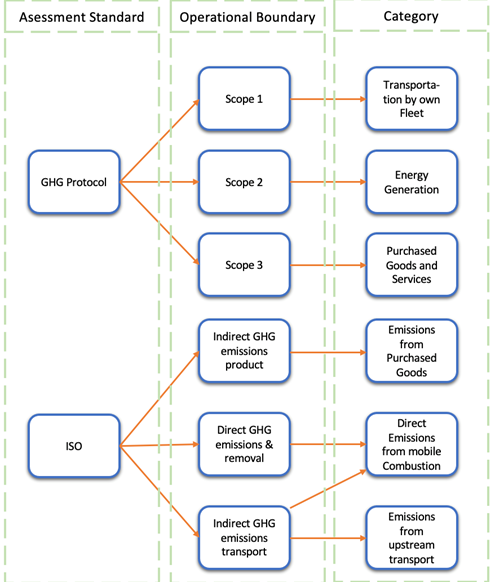
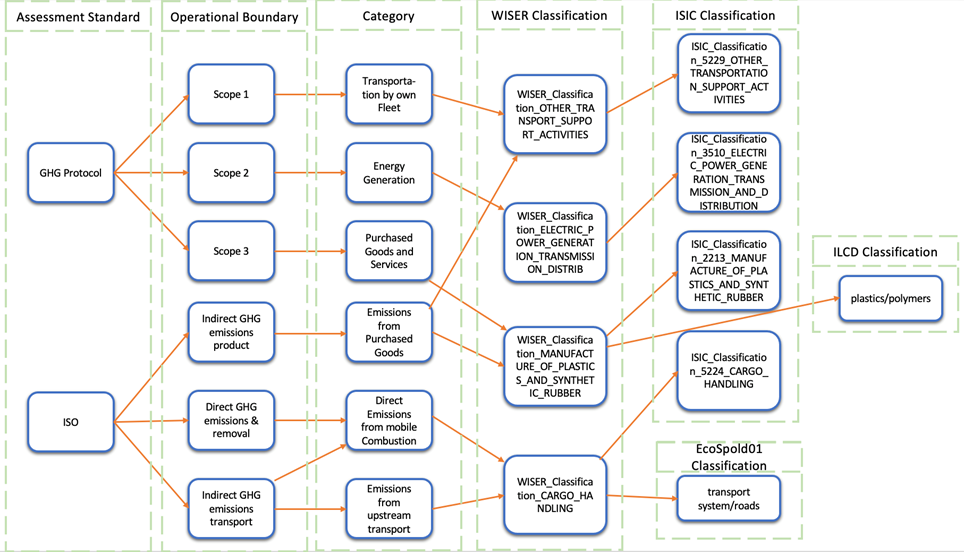
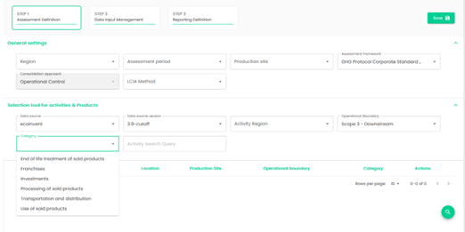

# Classification

A GHG standard can be seen as a rulebook that must be followed by environmental experts when carrying out a GHG assessment for a specific organisation, product, or service. However, such rulebooks are com-monly documents expressed in natural language (e.g. PDF reports) that need to be studied, interpreted, and can only be fully used by experts. This means that a report is made following a specific assessment stand-ard, and if it is required to have such report in a different standard, an environmental expert must start al-most from scratch. To alleviate this situation and its related workload, we propose to create automated tools that can help translating an assessment made in one standard to another. To this end, we need to cre-ate the machine readable and machine understandable representation of such rulebooks. In this section, we present the work we have been doing towards this automation objective, which consist in an ontology for classifications (see Section 3.1), ontologies of the assessment standards, and a bridge ontology between such standards (see WISER standard ontology in Section 0).

## Classifications ontology
The WISER classification ontology is needed to describe the core rules expressed in an assessment stand-ard given that activities and processes are classified according to the economic activity they belong to. However, there is disparity on the activity classification system that different databases use and how stand-ards group these activities. For example, ecoinvent, uses the United Nations industry classification system, ISIC (International Standard Industrial Classification of All Economic Activities) [4]; UVEK utilizes the Eco-Spold1 classifications and ILCD uses another classification system (see Figure 9). Since the objective of the WISER KG is to create uniform ways to query data that has been described in different manners, we need to handle the heterogeneity of the classification systems from databases and standards. To this end, we created an RDF representation of the classification system of the ILCD database (i.e., Plastics Europe), the UVEK and the ISIC classification system. We took the RDF representation of the ISIC classification sys-tem as a base to create the WISER classification ontology since ISIC describes classifications on the finest level of granularity when compared to the other options. We then linked the other two classification methods within the WISER classification ontology (e.g., looking at Figure 9, we can see examples of the WIS-ER_Classification_CARGO_HANDLING bridges an ISIC and an ILCD classification instances). Due to the hierar-chical nature of our approach, the KG enables querying for children or parents of a specific classification. Moreover, classifications that we have not yet considered can always be linked to the current WISER classi-fications, by linking them to the corresponding node at a higher or lower level of granularity. 

Figure 9. The WISER classification ontology for bridging different classification systems of databases.

###  Tools for Integrating Classification Systems of Databases
We have taken both a manual and a semi-automatic approach to create the link between the activity classi-fications of ISIC, the UVEK database, and the ILCD databases. 
#### Manual Approach
Specifically for the Plastics Europe database, which is expressed with the ILCD format, the mapping be-tween the different classification values was done by domain experts of Empa. In this process, an environ-mental expert analysed a name and description of a classification in Plastics Europe and compared it with the names and descriptions of the ISIC system to manually create 1 to 1 matches, which were documented in a spreadsheet file. Later, this spreadsheet was used as input for a script that converted the relationships documented on the spreadsheet file to relationships (edges) in the KG. 
#### Semi-automatic Approach
For the classification system that the UVEK database uses to describe activities, we were able to provide a semi-automatic way for finding corresponding classifications in the ISIC system. This is because, fortunate-ly, the ecoinvent API that provides the ISIC classification system, also provides corresponding classifica-tions in the EcoSpold01 format (i.e. UVEK database). To do this, we created a script capable of extracting this information from the API and converting these mappings into connections (i.e., edges) on the KG.
Unfortunately, not all EcoSpold01 classifications are available on the ecoinvent API. Thus, we are currently working on a second script that uses the search system of the UN Statistic Division  to look for possible classification mappings with missing categories.
 
## Ontology for Assessment Standards and Mapping of Classifications
Assessment standards define operational boundaries of organisations and categories of activities in differ-ent ways (see Figure 10). Moreover, the category of an assessment can be mapped to one or several data-base classifications (see Figure 11). To integrate the standards with the WISER classification system for da-tabases, we created an ontology in collaboration with Empa to describe in a machine readable and machine understandable way the assessment standards that until now are described only in text. To this end, envi-ronmental experts of SP1 analysed various standards and created a definition of their operational bounda-ries and determined the categories of activities that they use. We then created the RDF representation of such frameworks. Moreover, environmental experts of SP1 determined the links between the categories and the WISER classification ontology (see Figure 11), so we could create a more comprehensive version of the ontology. The ontologies and mappings created within this work are the foundation to provide the transla-tion services we aim, i.e., translating a report that has been created following one assessment standard into another.

 

Figure 10. Different operational boundaries for different frameworks.

The mappings between categories expressed in operational frameworks and the WISER ontology for classi-fication systems were inserted into the WISER KG using two linking approaches. 

1.	On the one hand, a combination of Framework-Operational Boundary-Category-Classification was posi-tively defined, indicating that the classification value of a dataset belongs to a specific standard. 

2.	On the other hand, a negative linking was also implemented, in which no-classification is linked to a Framework-Operational Boundary-Category combination, except for a small set of classification values. 

Figure 11. From framework description to database classification.

The description of GHG assessment standards and their mappings to specific database classifications have already been incorporated in the dashboards created in SP5, SP6 and SP7. Figure 12 shows the selec-tion of the ISO 14064-1 framework, which allows a user to select from different operational boundaries (e.g., direct GHG emissions and removals). Since such operational boundaries are linked to specific categories of activities, the user of the dashboard can also select the relevant categories that are automatically linked to the classification system of the databases. This allows users without a deep expertise in the field of envi-ronmental assessment to search for specific activities. Moreover, a user can search over different data-bases based on a chosen assessment standard, its operational boundaries and its categories of activities.

  that utilizes the assessment frameworks ontology")

Figure 12. User interface (SP3) that utilizes the assessment frameworks ontology.

In another example of the usage of the assessment frameworks ontology. In Figure 13, a user selects the GHG protocol corporate and Scope 3 - Downstream, and a list of categories available for this framework are presented.

 
Figure 13. A user selects the GHG protocol and Scope 3.
