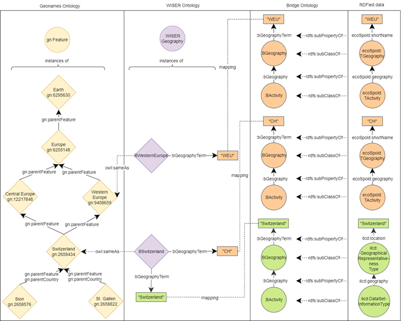
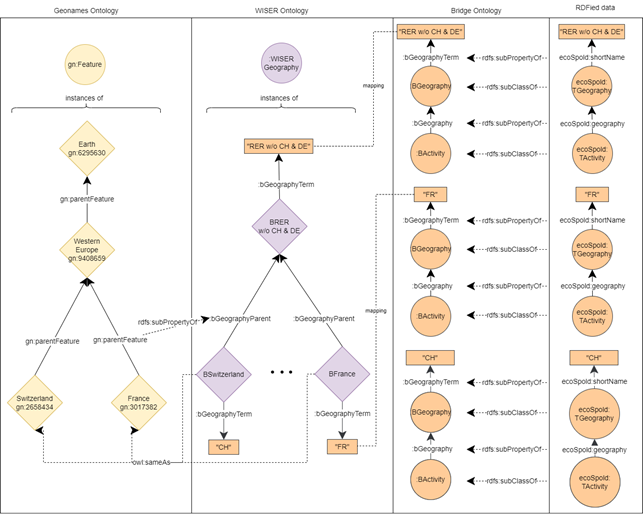
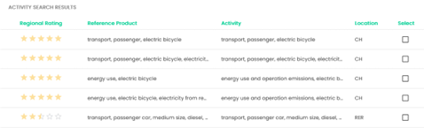

# Geonames

To enhance the filtering of scope 3 GHG data, our environmental experts colleagues raised the requirement of creating a flexible mechanism that allows looking for different datasets according to their specific geog-raphy (i.e. more representative of a selected context). Thus, we analysed the way such geographies are ex-pressed in the environmental databases that we currently include in WISER (see SP1) and found out that most of the databases indicate the country of a dataset (or activity) utilizing an ISO-conforming abbreviation (e.g., "DE" for Germany or "FR" for France). However, in some cases, specific regions (e.g., economic re-gions) are described with ad-hoc nomenclature e.g., “RER w/o CH & DE”, which stands for Europe exclud-ing Switzerland and Germany. To enable looking for datasets at a more regional (e.g., city) or global (i.e., continent) level, we decided to use the vast amounts of knowledge that the semantic Web makes available and integrated Geonames , an established ontology that gives access to fine grained location information.

To achieve such integration with the WISER data ontology, we followed a well-known methodology called SAMOD (a Simplified Agile Methodology for Ontology Development). SAMOD suggests the develop-ment of ontologies in a test-driven manner, to enable constant integration of use cases. Tackling a use case using SAMOD results in a bag of test cases that includes (among other elements): a set of motivating sce-narios, a set of competency questions (CQ), and a set of queries to answer such competency questions. In the following, we present some competency questions that our integration focuses on. 

```
CQ1. Given any region in the world: What are the available datasets in the WISER data KG that apply to this region? 
```

When searching for data of a specific region, the result should not only contain dataset that are valid for the exact region that a user specifies. The search results should also include data from greater regions contain-ing the specific region. For example, when looking for a city where a specific manufacturing site is located, a search on the KG should find data that not only corresponds to the state, but also to the country, conti-nent, and even the global datasets. 

To achieve this integration, we needed to cover two specific issues given the way that the geographical in-formation is expressed in the EcoSpold01 and ILCD based ontologies. The first issue corresponds to map-ping the string information of the datasets (e.g., “CH” for EcoSpold01, and “Switzerland” for ILCD) to a cor-responding bridge instance in the WISER data ontology (e.g., BSwitzerland) using the bGeographyTerm property. Figure 6 shows from right to left an example of datasets expressed in EcoSpold and ILCD. Then, to integrate the Geonames ontology with the WISER data ontology, a link is established between a WISER bridge instance (e.g., BSwitzerland) and its corresponding instance in the Geonames ontology (e.g., Switzer-land gn:2658494) using the owl:sameAs relationship. This bridging process was done for countries and other grouping regions (e.g., Western Europe) homogenizing the access to geography data expressed in Eco-Spold01, EcoSpold2, and ILCD. Moreover, the integration of Geonames enables the usage of its hierar-chical knowledge. Hence, given an activity with the geography “Switzerland”, it is possible to infer that such activity is also valid for Central Europe, Europe, and the World.



Figure 6. Integrating Geonames to the WISER Ontology

In our analysis of the environmental databases, we discovered a second issue to tackle: in the datasets, there exist geographical regions that do not have a corresponding region in the Geonames ontology. This is the case of the “RER w/o CH & DE” region, which stands for Europe without Switzerland and Germany. In order to still handle those use cases, we introduced our own WISER geographies (e.g., BRER w/o CH&DE) and created a bridge between the property gn:parentFeature and our own property :bGeographyParent (see Figure ).


 

Figure 7. Creating bridges for regions that are not defined in the Geonames ontology.

While it is necessary to provide the datasets that match a specific geographic region that a user is looking for, this is not sufficient. To create a valuable search result, the KG should be able to indicate how geo-graphically precise the dataset is, i.e., datasets for the specific city should be better ranked than datasets for the whole continent, since the data is more representative. To tackle this issue, we sought to respond the following CQ:

```
CQ2. Given the results from CQ1, how geographically representative are the found datasets with respect to a user search? 
```

One advantage of the integration of the Geonames ontology and the introduction of the property :bGeographyParent is that it gives us the possibility to rank the geographic feature with respect to a searched region. This is done by counting the steps between two regions. In Figure 7, Switzerland is shown two steps away from Earth, but only one step away from Western Europe. This information allows to dynami-cally compute how close a geography is with respect to a user search. Moreover, the additional knowledge that has been added with the Geonames ontology allow users to search for specific regions that might not be part of a dataset, but that might still apply in datasets for larger regions. Consider a search for the city of St. Gallen; when not finding an exact match, the Geonames hierarchy will be utilized to look for datasets which region might apply to St. Gallen. Thus, regions such as Eastern Switzerland, Switzerland, Western Eu-rope, Europe, and the World would be considered. The farther such regions are from the search term, the lower they are ranked. Figure 8 shows a screenshot of the ranking feature that has already been integrated by SP3 into the dashboard prototypes. This ranking is the result of a search for datasets in Switzerland; as it can be seen, a geography marked as RER (i.e., Europe) is ranked lower than perfect matches (i.e., CH).




Figure 8. The geography ranking feature integrated in a demonstrator.
