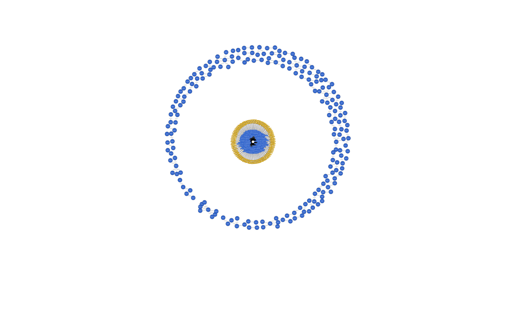

# PlasticsEurope

About 100 Plastics Europe members produce over 90% of all polymers in Europe. This is why the organization of PlasticsEurope is important.

PlasticsEurope has an openly available LCI database in ILCD format. This database was converted via the reflection based approach to a RDF Knowledge Graph.

If you want to have a look at the ontology in [Obsidian](https://obsidian.md/), have a look at this [application](https://github.com/wiser-flagship/wiser-sp4-ilcd-doc-converter.git)
