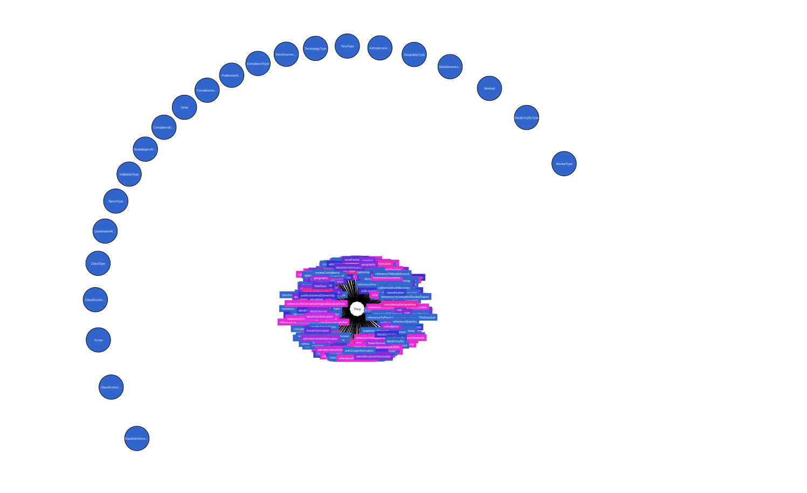

# UVEK

The Swiss departement for Environement, Trafic, Energy and Communication is regularly providing LCI data.
The current LCI data-base has the name: Ökobilanzdatenbestand DQRv2:2022. This data-base is provided in EcoSpold01 format.

With the reflective approach we transformed this data set into RDF as well.

If you want to have a look at the ontology in [Obsidian](https://obsidian.md/), have a look at this [application](https://github.com/wiser-flagship/wiser-sp4-ecospold1-doc-converter.git)