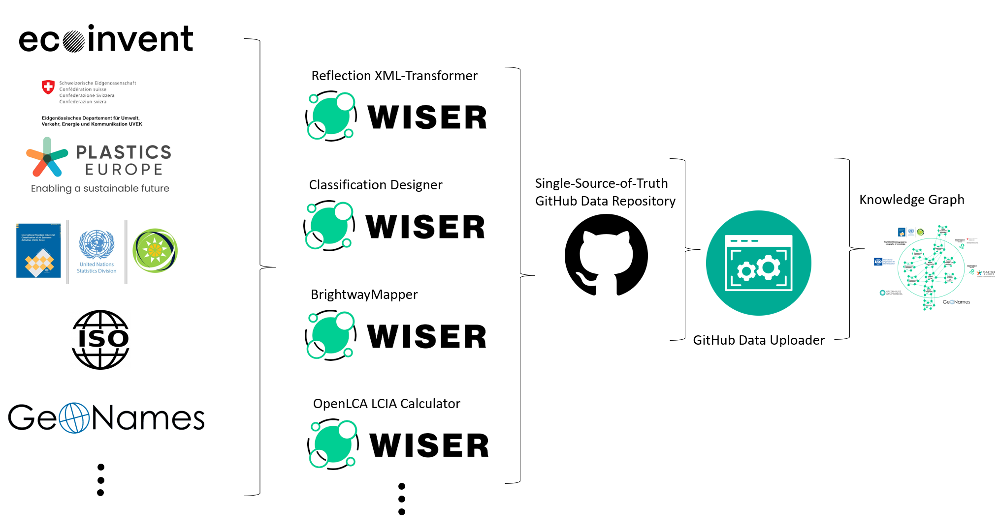

# Overall Goal

This documentation describes the work that has been carried out by SP4 regarding the creation of a common interface for querying data that has been described in different ways (i.e., data formats); towards the main objective of SP4, which is to create a KG that acts as a one-stop shop of GHG data. Moreover, additional efforts are reported on the integration of additional sources of knowledge and the creation of machine readable and machine understandable representations of assessment frameworks that up until now only exists in natural language form. The work in this report has been carried out in close collaboration with several members of the consortium; specifically, SP1 and SP3.

Furthermore, all relevant Github repositories will be linked.

