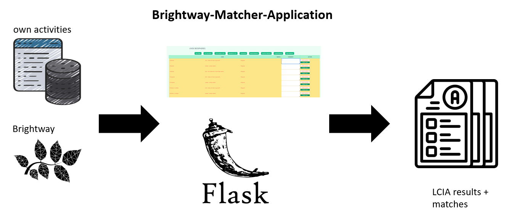

# Brigthway Mapper

The Brightway Mapper application matches own biosphere activities to Brighgway(EcoInven) biosphere activities.
It is based on [BW Matchbox](https://github.com/cauldron/bw_matchbox/) developed by Cauldron.

The application code can be found [here](https://github.com/wiser-flagship/sp4_wiser_htmx_matchbox).

An overview of the application is given below:

