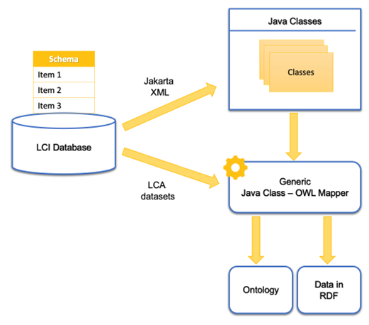
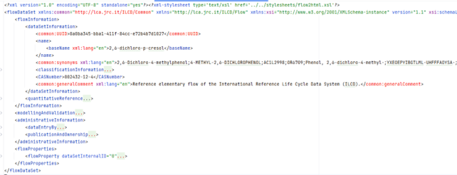
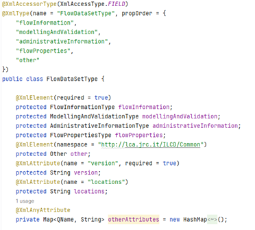
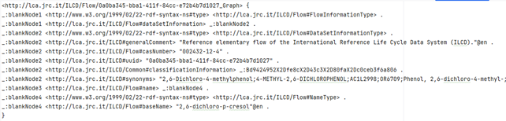

# Reflection Based XML Transformer

Given that we have decided to tackle first the most established databases to incorporate them into the WISER KG, and given that they are expressed in XML, we investigated ways of converting XML into RDF (the KG language). Several approaches were evaluated, such as the tool Ontmalizer  and opting for a manual approach. We selected a reflection-based approach that is detailed in the following.

Due to the generic interface of XML and the maturity of tools for working with data in XML, we rely on the Jakarta XML library  (formerly known as JAXB). This library allows to read the XSD-files (data schema file of an XML) provided by the data formats (e.g., ILCD and Ecospold01) that a database follows and convert them into their Java Class representation. The generated Java classes are a one-to-one abstraction of the given XSD file and are then used to create the RDF representation of the data format. The illustrations below shows an overview of this process; from an LCI database to an ontology and datasets expressed in RDF. For the last step, in which a Java class is converted to RDF, the algorithm in Table 1 is followed.

1)	Read a Java class.
2)	Check all available properties.
3)	If the property is of RDF literal type (i.e., an integer or a string)
    - Create an RDF-literal.
4)	If the property is not of literal type
    - Inspect the class in a recursive manner and go to number (1) considering the child class.

This process is exemplified in Figure 2, Figure 3, and Figure 4 with a fragment of an XML file (see Figure 2) that is then converted to a Java Class (see Figure 2) and finally to RDF (see Figure 3). 

Figure 1 displays the overall architecture of the program.

 
Figure 2. Example of data that describes a flow in XML (simplified extract)

 
Figure 3. An XML flow converted to a Java Class (simplified extract)

 
Figure 4. Java Class translated to RDF (simplified extract).

Utilizing this reflection-based method, it was possible to not only convert 1 to 1 the datasets expressed in XML to RDF, but we were also able to extract information about how these datasets relate to each other. We successfully implemented this approach for the EcoSpold01 and ILCD data formats; and converted the UVEK datasets and the Plastics Europe datasets to RDF, so they can be hosted in the WISER KG. 
The transformation application is already written in a very generic way, which allows other database to be converted with little extra effort. Nonetheless, before the program can be offered as a library like Ontmalizer, a generic configuration change to map specific literal classes should be implemented. For example, ILCD is using the datatype StringMultiLang, which can be mapped to a direct multi-language RDF-literal. This howev-er is ILCD-specific. These kind of datatypes needs to be manually discovered for each database.

The application can be found [here](https://github.com/wiser-flagship/wiser-sp4-generic-converter).
